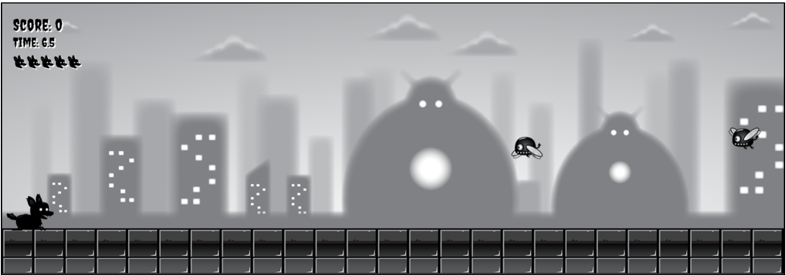

## Shadow Dog vs Monster

## Description
In **Shadow Dog vs Monster**, you play as a courageous dog on a quest to save its world from an invasion of terrifying monsters. Armed with determination and a rolling attack, the dog must defeat each monster to restore peace.

## Gameplay
- **Objective**: Defeat all the monsters in each level.
- **Controls**:
    - Use the arrow keys (up, down, left, right) to move the dog.
    - Press the **Enter** key to activate the rolling attack mode.
- **Enemies**:
    - Monsters will appear randomly on the screen.
    - Some monsters move slowly, while others are swift and aggressive.
    - Each monster has a different health level.
- **Health and Rolling Attack**:
    - The dog has a health bar. If it gets hit by a monster, its health decreases.
    - When the dog enters rolling attack mode, it becomes invulnerable and can defeat monsters by rolling into them.
- **Winning**:
    - To win, defeat get a target score by defeating monsters.   

## Tutorial
1. **Movement**:
    - Use the arrow keys to move the dog:
        - **Up Arrow**: Move upward
        - **Down Arrow**: Move downward
        - **Left Arrow**: Move left
        - **Right Arrow**: Move right
2. **Attacking**:
    - Approach a monster and press **Enter** to activate rolling attack mode.
    - While rolling, the dog is invulnerable and can defeat monsters on contact.
3. **Health and Energy**:
    - Monitor your health bar at the top of the screen.
4. **Score**:
    - Earn points for defeating monsters.
    - Collect bonus points by completing levels quickly. 

## Ready to Play?
Get ready to roll, bark, and defeat those monsters! Good luck, brave dog! 🐾